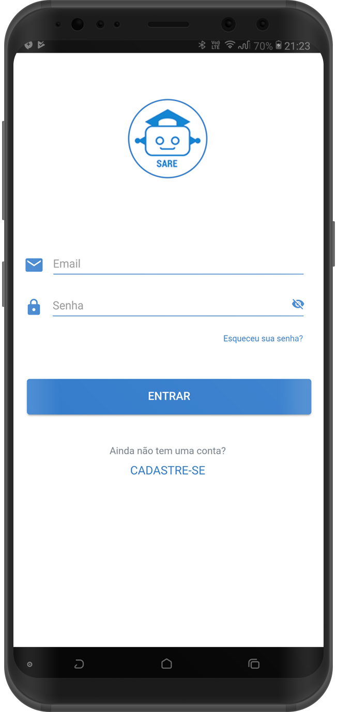

# SARE
###Sistema de Avaliação em Robótica Educativa

Aplicativo que auxilia professores da disciplina de robótica a acompanhar o desenvolvimento dos seus alunos em práticas de sala.
 

**Developed using**
- Ionic Framework v3
- Database: SQLite

 
**UI**

  

  

  

  

  

