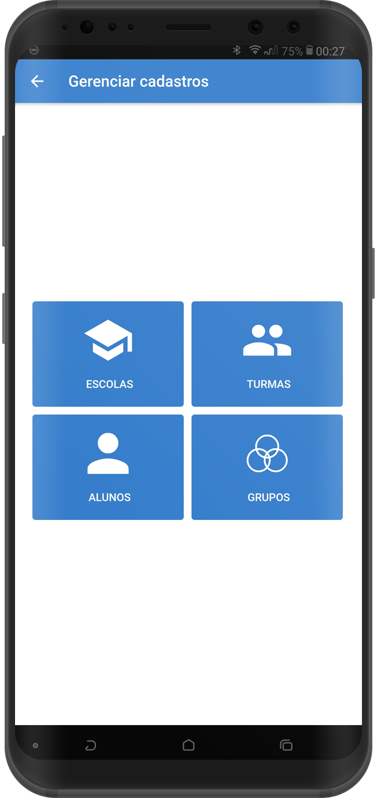

# SARE
###Sistema de Avaliação em Robótica Educativa
Aplicativo que auxilia professores da disciplina de robótica a acompanhar o desenvolvimento dos seus alunos em práticas de sala.

**Developed using**
- Ionic Framework v3
- Database: SQLite

**UI**

<!-- .element height="50%" width="50%" -->

<!-- .element height="50%" width="50%" -->

<!-- .element height="50%" width="50%" -->

<!-- .element height="50%" width="50%" -->

